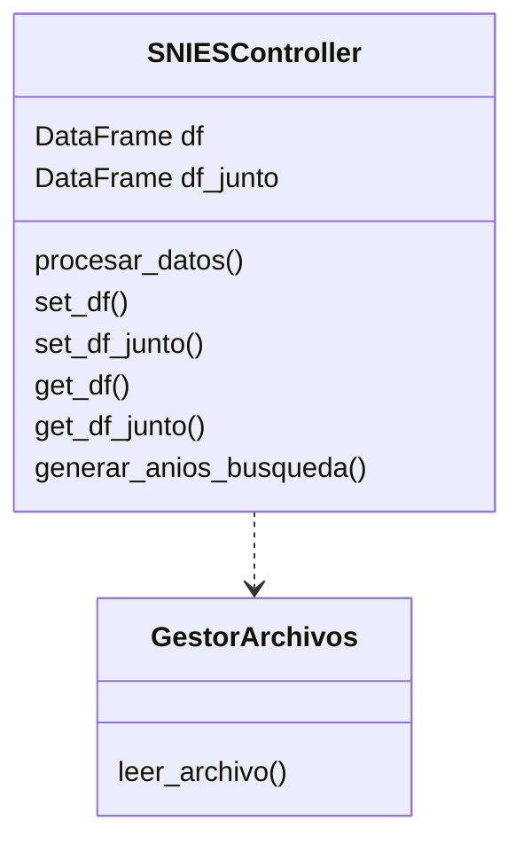

# snies_proyecto_3
Proyecto_3

# **SNIES EXTRACTOR por Syntax Error™**

El SNIES EXTRACTOR es un software que permite el análisis de los datos de estudiantes universitarios publicados por el Sistema Nacional de Instituciones de Educación Superior (SNIES) de Colombia a partir de los archivos de excel publicados en su página oficial.

**Link al SNIES:**

<https://snies.mineducacion.gov.co/portal/ESTADISTICAS/Bases-consolidadas/> 

El programa abrirá una página web en su navegador dondé podrá interactuar con el SNIES EXRACTOR. Para ejecutarlo primero, debe descargar este repositorio, crear un entorno virtual llamado *venv* o *.venv* y abrir el archivo *Ejecutar\_SNIES\_EXTRACTOR.cmd,* el cual le abrirá una ventana de la terminal de su dispositivo y una página web en su navegador predeterminado.

**Requerimientos del dispositivo:**

- Sistema Operativo Windows

**Diagrama UML del Proyecto**

# Manual Técnico

## Detalles del Funcionamiento del Proyecto

Detallaremos el funcionamiento del proyecto en esta sección.  
El proyecto está basado en Python y utiliza las bibliotecas **Pandas** y **Streamlit** para funcionar, y tiene múltiples funcionalidades, las cuales son las siguientes:

- **Lectura de archivos `.xlsx` (Excel)**
- **Búsqueda de programas académicos** por palabras clave.
- Selección de programas que se desean analizar.
- Análisis de estudiantes en distintas etapas:
  - Inscritos, admitidos, matriculados por primera vez,
  - Total de matriculados,
  - Total de graduados por programa.
- **Visualización de la información** de los programas seleccionados.
  - (Aquí se puede incluir una imagen de cómo se ve).
- Generación de **gráficos de líneas y barras** por tendencia histórica con los programas seleccionados y el dato que se desea analizar.
- Generación de un **gráfico comparativo** entre los programas seleccionados.
- **Subida de archivos** a la página generada con Streamlit.

---

### Explicación de las Funcionalidades

Una vez vistas todas las funcionalidades, pasemos a explicar cómo se utiliza cada una.

- La **lectura de archivos `.xlsx`** es la funcionalidad que nos permite obtener todos los datos que vamos a manejar. Esta funcionalidad lee los archivos ya presentes en el repositorio y los convierte en un dataframe, facilitando así la extracción de los datos deseados de estos archivos y de sus programas.
  
- Además, el programa incluye en la lectura de archivos los archivos que puede subir el usuario (explicación más adelante).
